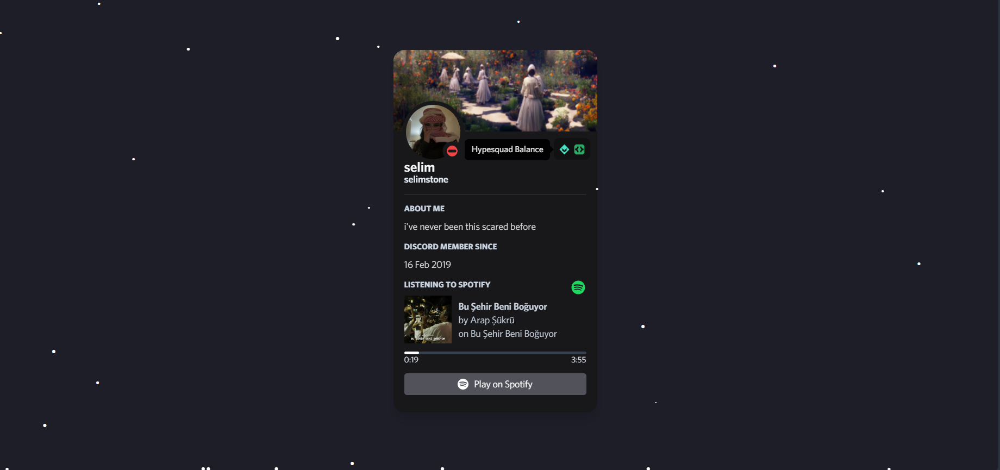

<div align="center">
	<p>
<a href="https://reactjs.org/"></a>
<a href="https://www.typescriptlang.org/"></a>
<a href="https://tailwindcss.com/"></a>
<br>

	</p>
</div>

## Getting Started
- Join the [Lanyard Discord server](https://discord.gg/lanyard)
- Rename the `.env.example` file to `.env` and fill out the values.

## Start Development Server

```bash
yarn dev
```

## Build to Production

```bash
yarn build
```

## Attributions

- [Lanyard](https://github.com/Phineas/lanyard) - [Phineas](https://github.com/Phineas)


## License

Distributed under the MIT license. See [``LICENSE``](https://github.com/seliim1337/web?tab=MIT-1-ov-file) for more information.
